# Exercises: Regular Expressions (RegEx)

## Problem 01. Match Full Name

Write a Program to match full names from a list of names and print them on the console.

Compose the Regular Expression

First, write a regular expression to match a valid full name, according to these conditions:
- A valid full name has the following characteristics:
    - It consists of two words.
    - Each word starts with a capital letter.
    - After the first letter, it only contains lowercase letters afterwards.
    - Each of the two words should be at least two letters long.
    - The two words are separated by a single space.
    
To help you out, we've outlined several steps:

1.	Use an online regex tester like https://regex101.com/ 
2.	Check out how to use character sets (denoted with square brackets - "[]")
3.	Specify that you want two words with a space between them (the space character ' ', and not any whitespace symbol)
4.	For each word, specify that it should begin with an uppercase letter using a character set. The desired characters are in a range – from 'A' to 'Z'.
5.	For each word, specify that what follows the first letter are only lowercase letters, one or more – use another character set and the correct quantifier.
6.	To prevent capturing of letters across new lines, put "\b" at the beginning and at the end of your regex. This will ensure that what precedes and what follows the match is a word boundary (like a new line).

In order to check your RegEx, use these values for reference (paste all of them in the Test String field):

<table>
<thead>
<tr>
<th>Match ALL of these</th>
<th>Match NONE of these</th>
</tr>
</thead>
<tbody>
<tr>
<td>Ivan Ivanov</td>
<td>ivan ivanov, Ivan ivanov, ivan Ivanov, IVan Ivanov, Ivan IvAnov, Ivan	Ivanov</td>
</tr>
</tbody>
</table>

By the end, the matches should look something like this:

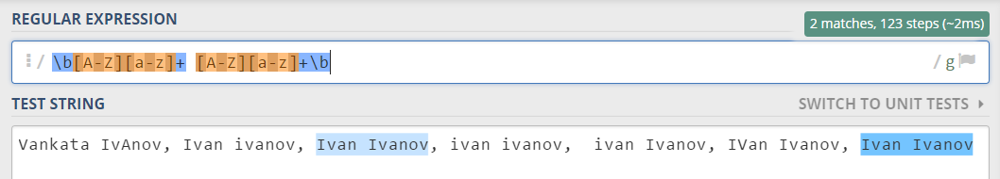
 
After you've constructed your regular expression, it's time to write the solution in Python.

### Implement the Solution in Python

Create a new Python file and copy your regular expression into a variable:

 
Note: It's usually a good idea to use a verbatim string (r in front of the string literal) to store regular expressions, since characters like the backslash "\" can clash with string escaping.

Now, it's time to read the input and extract all the matches from it. For this, we can import the re module, and use re.findall() function. 

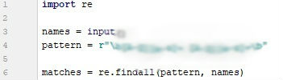
 
Important: re.findall return only regex without groups!

After we extract all the matches, we need to iterate over the matches and print every match that we found:
 
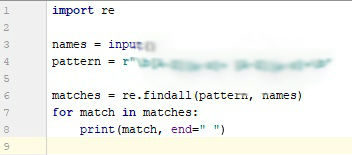
 
### Examples

<table>
<tbody>
<tr>
<th>Input</th>
</tr>
<tr>
<td>Ivan Ivanov, Ivan ivanov, ivan Ivanov, IVan Ivanov, Test Testov, Ivan	Ivanov</td>
</tr>
<tr>
<th>Output</th>
</tr>
<tr>
<td>Ivan Ivanov Test Testov</td>
</tr>
</tbody>
</table>

<b>Solution: <a href="./ex_01_match_full_name.py">ex_01_match_full_name.py</a></b>

## Problem 02. Match Phone Number

Write a regular expression to match a valid phone number from Sofia. After you find all valid phones, print them on the console, separated by space " ".

### Compose the Regular Expression

A valid number has the following characteristics:

- It starts with "+359"
- Then, it is followed by the area code (always 2)
- After that, it's followed by the number itself:
    - The number consists of 7 digits (separated in two groups of 3 and 4 digits respectively). 
- The different parts are separated by either a space or a hyphen ('-').

You can use the following RegEx properties to help with the matching: 

- Use quantifiers to match a specific number of digits
- Use a capturing group to make sure the delimiter is only one of the allowed characters (space or hyphen) and not a combination of both (e.g. +359 2-111 111 has mixed delimiters, it is invalid). Use a group backreference to achieve this.
- Add a word boundary at the end of the match to avoid partial matches (the last example on the right-hand side).
- Ensure that before the '+' sign there is either a space or the beginning of the string.

You can use the following table of values to test your RegEx against:

<table>
<thead>
<tr>
<th>Match ALL of these</th>
<th>Match NONE of these</th>
</tr>
</thead>
<tbody>
<tr>
<td>+359 2 222 2222 +359-2-222-2222</td>
<td>359-2-222-2222, +359/2/222/2222, +359-2 222 2222 +359 2-222-2222, +359-2-222-222, +359-2-222-22222</td>
</tr>
</tbody>
</table>

### Implement the Solution in Python

Now it's time to write the solution, so let's start writing!

First, just like in the previous problem, put your RegEx in a variable:

 
After that, let's get all matches using re.finditer:

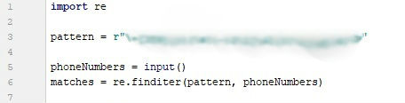

After that, just print the valid phone number array:

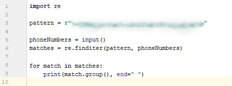

### Examples

<table>
<tbody>
<tr>
<th>Input</th>
</tr>
<tr>
<td>+359 2 222 2222,359-2-222-2222, +359/2/222/2222, +359-2 222 2222 +359 2-222-2222, +359-2-222-222, +359-2-222-22222 +359-2-222-2222</td>
</tr>
<tr>
<th>Output</th>
</tr>
<tr>
<td>+359 2 222 2222 +359-2-222-2222</td>
</tr>
</tbody>
</table>

<b>Solution: <a href="./ex_02_match_phone_number.py">ex_02_match_phone_number.py</a></b>

## Problem 03. Match Hexadecimal Numbers

Write a program, which finds all valid hexadecimal numbers in a string and print them space-separated.

### Compose the Regular Expression

A valid hexadecimal number follows these conditions:

- Can have “0x” in front of it (not required)
- Has one or more hexadecimal digits after it (0-9 and A-F).
- Doesn't have anything on either of its sides (use \b).

You can follow the table below to help with composing your RegEx:

<table>
<thead>
<tr>
<th>Match ALL of these</th>
<th>Match NONE of these</th>
</tr>
</thead>
<tbody>
<tr>
<td>0x10 0xAB 0x1F 10 AB 1F FF</td>
<td>0xG G 0x4G 4G 0xFG FG</td>
</tr>
</tbody>
</table>
	
Find all the hexadecimal numbers from the string and print them on the console, separated by spaces.

### Implement the Solution in Python

After we're done composing our RegEx, we can put it inside a variable:

 

After that, we can read the input from the console, save it to a variable and match it against our RegEx:

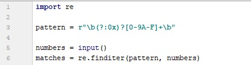

Finally, we can just print the output:

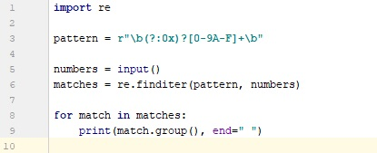
 
### Examples

<table>
<thead>
<tr>
<th>Input</th>
<th>Output</th>
</tr>
</thead>
<tbody>
<tr>
<td>1F 0xG 0x1F G 0x4G 4G 0xAB 0xFG FG 0x10   10 AB  FF</td>
<td>1F 0x1F 0xAB 0x10 10 AB FF</td>
</tr>
</tbody>
</table>

<b>Solution: <a href="./ex_03_match_hexadecimal_number.py">ex_03_match_hexadecimal_number.py</a></b>

### Problem 04. Match Dates

Write a program, which matches a date in the format "dd{separator}MMM{separator}yyyy". Use named capturing groups in your regular expression.

### Compose the Regular Expression

Every valid date has the following characteristics:

- Always starts with two digits, followed by a separator
- After that, it has one uppercase and two lowercase letters (e.g. Jan, Mar).
- After that, it has a separator and exactly 4 digits (for the year).
- The separator could be either of three things: a period ("."), a hyphen ("-") or a forward slash ("/")
- The separator needs to be the same for the whole date (e.g. 13.03.2016 is valid, 13.03/2016 is NOT). Use a group backreference to check for this.

You can follow the table below to help with composing your RegEx:

<table>
<thead>
<tr>
<th>Match ALL of these</th>
<th>Match NONE of these</th>
</tr>
</thead>
<tbody>
<tr>
<td>13/Jul/1928, 10-Nov-1934, 25.Dec.1937</td>
<td>01/Jan-1951, 23/sept/1973, 1/Feb/2016</td>
</tr>
</tbody>
</table>
	
Use named capturing groups for the day, month and year.

Since this problem requires more complex RegEx, which includes named capturing groups, we'll take a look at how to construct it:

- First off, we don't want anything at the start of our date, so we're going to use a word boundary "\b":

    

- Next, we're going to match the day, by telling our RegEx to match exactly two digits, and since we want to extract the day from the match later, we’re going to put it in a capturing group:

    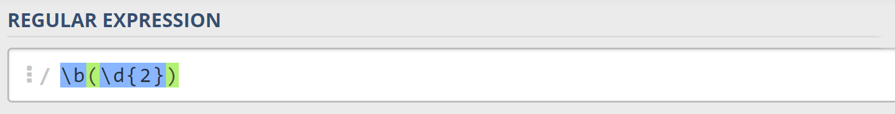
    
    We’re also going to give our group a name, since it’s easier to navigate by group name than by group index:

    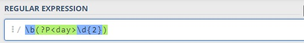
    
- Next comes the separator – either a hyphen, period or forward slash. We can use a character class for this:

    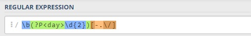
    
    Since we want to use the separator we matched here to match the same separator further into the date, we're going to put it in a capturing group:
    
    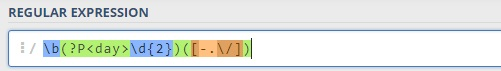

- Next comes the month, which consists of a capital Latin letter and exactly two lowercase Latin letters:

    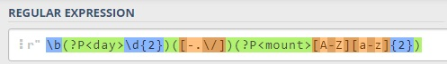
 
- Next, we're going to match the same separator we matched earlier. We can use a backreference for that:

    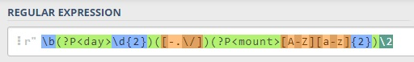
 
- Next up, we're going to match the year, which consists of exactly 4 digits:

    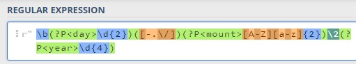
 
- Finally, since we don't want to match the date if there's anything else glued to it, we're going to use another word boundary for the end:
    
    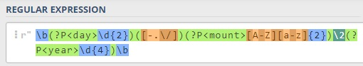
 
Now it's time to find all the valid dates in the input and print each date in the following format: "Day: {day}, Month: {month}, Year: {year}", each on a new line.

### Implement the Solution in Python

First off, we're going to put our RegEx in a variable and get a matches from the string:

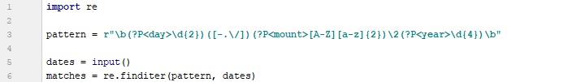
 
Next, we're going to iterate over every single match and extract the day, month and year from the groups. Тhe cool thing in python is the ability to simultaneously summon the group at the name value as well as the original group. As an example match.group('day') will return the same result like match.group(1)

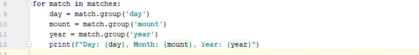
 
### Examples

<table>
<tbody>
<tr>
<th>Input</th>
</tr>
<tr>
<td>13/Jul/1928, 10-Nov-1934, , 01/Jan-1951,f 25.Dec.1937 23/09/1973, 1/Feb/2016</td>
</tr>
<tr>
<th>Output</th>
</tr>
<tr>
<td>Day: 13, Month: Jul, Year: 1928 Day: 10, Month: Nov, Year: 1934 Day: 25, Month: Dec, Year: 1937</td>
</tr>
</tbody>
</table>

<b>Solution: <a href="./ex_04_match_dates.py">ex_04_match_dates.py</a></b>

## Problem 05. Match Numbers

Write a program, which finds all integer and floating-point numbers in a string.

### Compose the Regular Expression

A number has the following characteristics:

- Has either whitespace before it or the start of the string (match either ^ or what’s called a positive lookbehind). The entire syntax for the beginning of your RegEx might look something like "(^|(?<=\s))".
- The number might or might not be negative, so it might have a hyphen on its left side ("-").
- Consists of one or more digits.
- Might or might not have digits after the decimal point
- The decimal part (if it exists) consists of a period (".") and one or more digits after it. Use a capturing group.
- Has either whitespace before it or the end of the string (match either $ or what’s called a positive lookahead). The syntax for the end of the RegEx might look something like "($|(?=\s))".

Let's see how we would translate the above rules into a regular expression:

- First off, we need to establish what needs to exist before our number. We can't use \b here, since it includes "-", which we need to match negative numbers. 

    Instead, we'll use a positive lookbehind, which matches if there's something immediately behind it. We'll match if we're either at the start of the string (^), or if there's any whitespace behind the string:
    
 
- Next, we'll check whether there's a hyphen, signifying a negative number:
    
    
    
    Since having a negative sign isn't required, we'll use the "?" quantifier, which means "between 0 and 1 times".
    
- After that, we'll match any integers – naturally, consisting one or more digits:
    
    
 
- Next, we’ll match the decimal part of the number, which might or might not exist (note: we need to escape the period character, as it’s used for something else in RegEx):

    
  
- Finally, we’re going to use the same logic for the end of our string as the start – we’re going to match only if the number has either a whitespace or the end of the string ("$"):

    
 
You can follow the table below to help with composing your RegEx:

<table>
<thead>
<tr>
<th>Match ALL of these</th>
<th>Match NONE of these</th>
</tr>
</thead>
<tbody>
<tr>
<td>1 -1 123 -123 123.456 -123.456</td>
<td>1s s2 s-s -1- _55_ s-2 s-3.5 s-1.1</td>
</tr>
</tbody>
</table>
	
Find all the numbers from the string and print them on the console, separated by spaces.

### Implement the Solution in Python

Now that we've written our regular expression, we can start by putting it in a variable and extracting the matches:

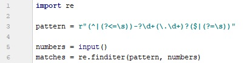
 
After that, it's only a matter of printing the numbers, separated by spaces:

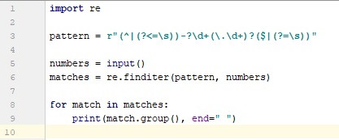
 
### Examples

<table>
<thead>
<tr>
<th>Input</th>
<th>Output</th>
</tr>
</thead>
<tbody>
<tr>
<td>1 -1 1s 123 s-s -123 _55_ _f 123.456 -123.456 s-1.1 s2 -1- zs-2 s-3.5</td>
<td>1	-1 123 -123 123.456 -123.456</td>
</tr>
</tbody>
</table>

<b>Solution: <a href="./ex_05_match_numbers.py">ex_05_match_numbers.py</a></b>

## Problem 06. Replace \<a> Tag

Write a program that replaces in a HTML document given as string all the tags <a href=…>…</a> with corresponding tags [URL href=…>…[/URL]. Read an input, until you receive the "end" command. Print the lines on the console, but with the <a> tags replaced.

### Examples

### Input

    <ul>
      <li>
        <a href="http://softuni.bg">SoftUni</a>
     </li>
    </ul>
    end
 
### Output

    <ul>
      <li>
        [URL href="http://softuni.bg"]SoftUni[/URL]
      </li>
    </ul>

<b>Solution: <a href="./ex_06_replace_tags.py">ex_06_replace_tags.py</a></b>

## Problem 07. Cards

You will be given sequences of playing cards. Your task is to print the valid ones of them, separated by a space.

The VALID playing cards have:

- power – 2, 3, 4… 10, J, Q, K, A.
- suit – S, H, D, C

A card is formed by its power and its suit in the following format: {power}{suit}. . ., but ONLY those with valid power and valid suit, should be considered VALID.

So a valid card would look like this: KS, 10S, 2D, 3D. 

### Input

The input will consist of a single line, containing a sequence of cards.

### Output

The output should be a single line, containing the valid cards, separated by a space.

### Examples

<table>
<thead>
<tr>
<th>Input</th>
<th>Output</th>
</tr>
</thead>
<tbody>
<tr>
<td>2S3S4S5S6S</td>
<td>2S 3S 4S 5S 6S</td>
</tr>
<tr>
<td>2SASKS6SJSQSOS</td>
<td>2S AS KS 6S JS QS</td>
</tr>
</tbody>
</table>

<b>Solution: <a href="./ex_07_cards.py">ex_07_cards.py</a></b>

	
## Problem 08. Word Encounter

You will be given a filter, in the form of a string of two characters – the first being an ASCII character, and the second – a digit. 

You will then receive a sequence of sentences. You must extract all words from those sentences, and print only the words that contain the given filter character, at least N times – N being the filter digit.

There are 2 types of sentences – Valid and Invalid. The valid ones, always start with a capital letter, and always end with one of the following characters: ".", "!", "?". Invalid sentences, should be ignored.

Note: You WILL NOT be given more than 1 sentence on a single input line.

The input sequence ends, when you receive the command "end". After that you must print all the filtered words, you've gathered.

The valid words must be printed, on a single line, separated by a comma and a space.

### Examples

<table>
<thead>
<tr>
<th>Input</th>
<th>Output</th>
</tr>
</thead>
<tbody>
<tr>
<td>l2 This will, likely be a funny feeling, Laslo. Will you come to my playlife ;)? end</td>
<td>will, likely, Will, playlife</td>
</tr>
<tr>
<td>o1 How about... No... Maaan, this is amazing! Yeah; I know bro! end</td>
<td>How, about, No, know, bro</td>
</tr>
</tbody>
</table>

### Hint

Check if there is a way to find where a word, in a sentence, starts, and ends. There surely must be a way to do that with Regular Expressions.

<b>Solution: <a href="./ex_08_word_encounter.py">ex_08_word_encounter.py</a></b>

## Problem 09. Fish Statistics

You are a marine biologist tasked with researching various types of fish. You will receive a single line on the console as input. From this line, you must extract all the fish you find and print statistics about each one.

Fish are categorized by three criteria: tail length, body length and status. A standard fish looks like this:

    ><(((('>

This fish has a tail length of 1, a body length of 4 and has the status "Awake", since its eye is open. One ASCII character represents 2 centimeters in real life. By those standards, this fish has a tail length of 2 cm and a body length of 8 cm. There are various types of tails, bodies and statuses, which are described below:

- Tail types:
    - Tail longer than 5 "<" characters -> Long
    - Tail longer than 1 "<" characters -> Medium
    - Tail, which is 1 "<" character long -> Short
    - Nonexistent tail -> None
- Body types:
    - Body longer than 10 "(" characters -> Long
    - Body longer than 5 "(" characters -> Medium
    - Any other length -> Short
- Statuses:
    - ' -> Awake
    - \- -> Asleep
    - x -> Dead
 
The input will contain a variable amount of fish, separated by any sequence of ASCII characters. There's a possibility you might receive input, which has no fish – in this case, just print "No fish found.", and end the program. 

### Examples

#### Input

    ><(((('> >>>><((((((((('>~~~~~<((->~~~  o o >>>><((x>

#### Output

    Fish 1: ><(((('>
      Tail type: Short (2 cm)
      Body type: Short (8 cm)
      Status: Awake
    Fish 2: >>>><((((((((('>
      Tail type: Medium (8 cm)
      Body type: Medium (18 cm)
      Status: Awake
    Fish 3: <((->
      Tail type: None
      Body type: Short (4 cm)
      Status: Asleep
    Fish 4: >>>><((x>
      Tail type: Medium (8 cm)
      Body type: Short (4 cm)
      Status: Dead
  
#### Input
    
                o oo     >>>><((->           * ()()()():
#### Output

    Fish 1: >>>><((->
      Tail type: Medium (8 cm)
      Body type: Short (4 cm)
      Status: Asleep

#### Input

    o  o     ><(-> >><(('> <(((((((((x>  *  #%#$@     *	

#### Output

    Fish 1: ><(->
      Tail type: Short (2 cm)
      Body type: Short (2 cm)
      Status: Asleep
    Fish 2: >><(('>
      Tail type: Medium (4 cm)
      Body type: Short (4 cm)
      Status: Awake
    Fish 3: <(((((((((x>
      Tail type: None
      Body type: Medium (18 cm)
      Status: Dead

#### Input

    o xx xxxx  ~ ~ ~ xxxx

#### Output

	No fish found.

<b>Solution: <a href="./ex_09_fish_statistics.py">ex_09_fish_statistics.py</a></b>

## Problem 10. Happiness Index

You will be given a string, consisting of one or several emoticons and random garbage characters in-between them. Your task is to count the happy and sad emoticons and calculate the happiness index of the string. The index is calculated by this formula: {happyEmoticonsCount} / {sadEmoticonsCount}. The happiness index is then rounded to the second decimal place. Two emoticons will never touch.

The emoticons of all the emotion types are as follows:

    Happy: :), :D, ;), :*, :], ;], :}, ;}, (:, *:, c:, [:, [;
    Sad: :(, D:, ;(, :[, ;[, :{, ;{, ):, :c, ]:, ];

After you calculate the happiness index, print the final emoticon score, following this format:

    Happiness index greater than or equal to 2 -> :D
    Happiness index greater than 1 -> :)
    Happiness index equal to 1 -> :|
    Happiness index smaller than 1 -> :(

### Examples

<table>
<thead>
<tr>
<th>Input</th>
<th>Output</th>
</tr>
</thead>
<tbody>
<tr>
<td>:)^%&:)**&:]v;)ff:(</td>
<td>Happiness index: 4.00 :D [Happy count: 4, Sad count: 1]</td>
</tr>
<tr>
<td>&&:(&:)z:)zz%%!%%!%%!%:(</td>
<td>Happiness index: 1.00 :| [Happy count: 2, Sad count: 2]</td>
</tr>
<tr>
<td><<<<<<<<<<<]:bb:[<<<<<<<<<:}<<<<<<:(<<<<<<:)z:)z:)&@^@%@</td>
<td>Happiness index: 1.33 :) [Happy count: 4, Sad count: 3]</td>
</tr>
<tr>
<td>;(&m%td[:^i+@#:{eqk#n</td>
<td>Happiness index: 0.50 :( [Happy count: 1, Sad count: 2]</td>
</tr>
</tbody>
</table>

### Hints

- Regex named capturing groups might come in handy for this problem.

<b>Solution: <a href="./ex_10_happines_index.py">ex_10_happines_index.py</a></b>

## Problem 11. \*Query Mess

This problem is originally from the JavaScript Basics Exam (22 November 2014). You may check your solution here.

Ivancho participates in a team project with colleagues at SoftUni.  They have to develop an application, but something mysterious happened – at the last moment all team members… disappeared!  And guess what? He is left alone to finish the project.  All that is left to do is to parse the input data and store it in a special way, but Ivancho has no idea how to do that! Can you help him?

### Input

The input comes from the console on a variable number of lines and ends when the keyword "END" is received.  

For each row of the input, the query string contains pairs field=value. Within each pair, the field name and value are separated by an equals sign, '='. The series of pairs are separated by an ampersand, '&'. The question mark is used as a separator and is not part of the query string. A URL query string may contain another URL as value. The input data will always be valid and in the format described. There is no need to check it explicitly.

### Output

For each input line, print on the console a line containing the processed string as follows:  key=\[value]nextkey=\[another  value] … etc. 

Multiple whitespace characters should be reduced to one inside value/key names, but there shouldn't be any whitespaces before/after extracted keys and values. If a key already exists, the value is added with comma and space after other values of the existing key in the current string.  See the examples below.  

### Constraints

    - SPACE is encoded as '+' or "%20". Letters (A-Z and a-z), numbers (0-9), the characters '*', '-', '.', '_' and other non-special symbols are left as-is.
    - Allowed working time: 0.2 seconds. Allowed memory: 16 MB.

### Examples

<table>
<tbody>
<tr>
<th>Input</th>
</tr>
<tr>
<td>login=student&password=student END</td>
</tr>
<tr>
<th>Output</th>
</tr>
<tr>
<td>login=[student]password=[student]</td>
</tr>
</tbody>
</table>

<table>
<tbody>
<tr>
<th>Input</th>
</tr>
<tr>
<td>field=value1&field=value2&field=value3 http://example.com/over/there?name=ferret END</td>
</tr>
<tr>
<th>Output</th>
</tr>
<tr>
<td>field=[value1, value2, value3] name=[ferret]</td>
</tr>
</tbody>
</table>

<table>
<tbody>
<tr>
<th>Input</th>
</tr>
<tr>
<td>foo=%20foo&value=+val&foo+=5+%20+203 foo=poo%20&value=valley&dog=wow+ url=https://softuni.bg/trainings/coursesinstances/details/1070 https://softuni.bg/trainings.asp?trainer=nakov&course=oop&course=php END</td>
</tr>
<tr>
<th>Output</th>
</tr>
<tr>
<td>foo=[foo, 5 203]value=[val] foo=[poo]value=[valley]dog=[wow] url=[https://softuni.bg/trainings/coursesinstances/details/1070] trainer=[nakov]course=[oop, php]</td>
</tr>
</tbody>
</table>

<b>Solution: <a href="./ex_11_query_mess.py">ex_11_query_mess.py</a></b>

## Problem 12. \*Use Your Chains, Buddy

This problem is from the JavaScript Basics Exam (9 January 2015). You may check your solution here.

You are in Cherny Vit now and there are 12km to Anchova Bichkiya Hut. You need to get there by car. But there is so much snow that you need to use car chains. In order to put them on the wheels correctly, you need to read the manual. But it is encrypted…

As input you will receive an HTML document as a single string. You need to get the text from all the 
 tags and replace all characters which are not small letters and numbers with a space " ". After that you must decrypt the text – all letters from a to m are converted to letters from n to z (a -> n; b -> o; … m -> z). The letters from n to z are converted to letters from a to m (n -> a; o -> b; … z -> m). All multiple spaces should then be replaced by only one space.

For example, if we have "
Santa

znahny # grkg ()&^^^&12
" we extract "znahny # grkg ()&^^^&12". Every character that is not a small letter or a number is replaced with a space ("znahny grkg       12"). We convert each small letter as described above ("znahny grkg       12" -> "manual text       12") and replace all multiple spaces with only one space ("manual text 12"). Finally, we concatenate the decrypted text from all 

 tags (in this case, it's only one). And there you go – you have the manual ready to read!

### Input

The input is read from the console and consists of just one line – the string with the HTML document.

The input data will always be valid and in the format described. There is no need to check it explicitly.

### Output

Print on a single line the decrypted text of the manual. See the given examples below.

### Constraints

- Allowed working time: 0.2 seconds. Allowed memory: 16 MB.

### Examples

<table>
<tbody>
<tr>
<th>Input</th>
</tr>
<tr>
<td><html><head><title></title></head><body><h1>hello</h1>
znahny!@#%&&&&****

<button>dsad</button>

grkg^^^^%%%)))([]12
</body></html></td>
</tr>
<tr>
<th>Output</th>
</tr>
<tr>
<td>manual text 12</td>
</tr>
</tbody>
</table>

<table>
<tbody>
<tr>
<th>Input</th>
</tr>
<tr>
<td><html><head><title></title></head><body><h1>Intro</h1><ul><li>Item01</li><li>Item02</li><li>Item03</li></ul>
jura qevivat va jrg fyvccrel fabjl

<button>Click me, baby!</button>

 pbaqvgvbaf fabj  qpunvaf ner nofbyhgryl rffragvny sbe fnsr unaqyvat nygubhtu fabj punvaf znl ybbx 
This manual is false, do not trust it! The illuminati wrote it down to trick you!
vagvzvqngvat gur onfvp vqrn vf ernyyl fvzcyr svg gurz bire lbhe gverf qevir sbejneq fybjyl naq gvtugra gurz hc va pbyq jrg

 pbaqvgvbaf guvf vf rnfvre fnvq guna qbar ohg vs lbh chg ba lbhe gverf
</body></td>
</tr>
<tr>
<th>Output</th>
</tr>
<tr>
<td>when driving in wet slippery snowy conditions snow dchains are absolutely essential for safe handling although snow chains may look intimidating the basic idea is really simple fit them over your tires drive forward slowly and tighten them up in cold wet conditions this is easier said than done but if you put on your tires</td>
</tr>
</tbody>
</table>

<b>Solution: <a href="./ex_12_use_yout_chains.py">ex_12_use_yout_chains.py</a></b>

## Problem 13.  \*Commits

Believe it or not, GitHub doesn’t process its commits using software. They achieve their versatile version control by employing the services of a small man, named Master Branch. Mr. Branch is sick of parsing the huge amounts of data every single day and needs your help.

Write a program, which receives lines of URLs. Until you receive the command "git push", your task is to parse the URLs, which come in the following format:

    https://github.com/{user}/{repo}/commit/{hash},{message},{additions},{deletions}

Valid input will follow this format. If any input doesn’t follow this format, ignore it. The validation rules are as follows:

- The username may contain alphanumeric characters (Latin letters and digits) and hyphens (-).
- The repository name may contain letters, hyphens and underscores.
- The commit hash will be a SHA-1 hash, and as such, it may contain only hexadecimal characters (digits and letters A through F). Since SHA-1 hashes are always 20 bytes long, the commit hash will also always be 40 characters long.
- The message may contain any character, except the new line character.
- The additions and deletions are numbers and may only contain digits.

While parsing the input, you also need to categorize it for Mr. Branch. Every user has his own repos (a user cannot have two repos with the same name) and every repo has a list of commits. The users are sorted alphabetically by name. The repos are also sorted alphabetically by name. The commits are sorted by order of insertion.

After you receive the command "git push", your task is to print information about the commits in the following format:

    {user}:
      {repo}:
        commit {hash}: {message} ({additionsCount} additions, {deletionsCount} deletions)
        commit {hash}: {message} ({additionsCount} additions, {deletionsCount} deletions)
        …
        Total: {totalAdditionsCount} additions, {totalDeletionsCount} deletions

### Examples

#### Input

    https://github.com/gosho/http-parser/commit/f17c563aed112dabbdbe977fcdb88772be7d85eb,general fixes,14,3
    https://github.com/pesho-1232/db-checker/commit/5ca49ccc157c98af2c71391223e4b254ee327134,fix SELECT statement,9,19
    https://github.com/gosho/http-parser/commit/1f0abbdf5006b4a88aed1b72f9a937b35a5126dc,One does not simply merge into master,1,15
    https://github.com/stamat4o/hackertools/commit/ddb473ab0304e5e843983da8b26925dbb3495afa,another big bag of changes,8,18
    git push

#### Output

    gosho:
      http-parser:
        commit f17c563aed112dabbdbe977fcdb88772be7d85eb: general fixes (14 additions, 3 deletions)
        commit 1f0abbdf5006b4a88aed1b72f9a937b35a5126dc: One does not simply merge into master (1 additions, 15 deletions)
        Total: 15 additions, 18 deletions
    pesho-1232:
      db-checker:
        commit 5ca49ccc157c98af2c71391223e4b254ee327134: fix SELECT statement (9 additions, 19 deletions)
        Total: 9 additions, 19 deletions
    stamat4o:
      hackertools:
        commit ddb473ab0304e5e843983da8b26925dbb3495afa: another big bag of changes (8 additions, 18 deletions)
        Total: 8 additions, 18 deletions

#### Input

    https://github.com/A4B5TR/ceca-music-player/commit/5ca49ccc157c98af2c71391223e4b254ee327134,implement mile kitic,16,16
    https://github.com/Huosey/3ds-hax/commit/c4994a26e7370d9e482e9317c9a0489648c83fc6,for free,8,20
    https://github.com/A4B5TR/ceca-music-player/commit/136aa8bd1ac90d58230767027db5d2d0f3a6b9a5,lots and lots of changes,12,3
    https://github.com/A4B5TR/ceca-music-player/commit/d5cdb78e9a10af7f929dfa070577ef548bdadbb9,stuff,17,3
    https://github.com/dirtyhaxxor/csbotrepo/commit/8d99397247811cdc0210a92c9beb21bb20689dbc,add rush b functionality,1,6
    git push

#### Output

    A4B5TR:
      ceca-music-player:
        commit 5ca49ccc157c98af2c71391223e4b254ee327134: implement mile kitic (16 additions, 16 deletions)
        commit 136aa8bd1ac90d58230767027db5d2d0f3a6b9a5: lots and lots of changes (12 additions, 3 deletions)
        commit d5cdb78e9a10af7f929dfa070577ef548bdadbb9: stuff (17 additions, 3 deletions)
        Total: 45 additions, 22 deletions
    dirtyhaxxor:
      csbotrepo:
        commit 8d99397247811cdc0210a92c9beb21bb20689dbc: add rush b functionality (1 additions, 6 deletions)
        Total: 1 additions, 6 deletions

#### Input

    https://github.com/prakash/thymeleef/commit/e97c8637a13bf911e55030681884c8301a67e1dd,[MAJOR FEAT] minor fix,8,7
    https://github.com/ivanov33/superstartup/commit/56e566a92b48e430b4a81fd05fe777fbd612e085,it's 5am. It works. I quit.,9,2
    https://github.com/ivanov34/superstartup/commit/460afc15d7f7ab14be7966bc13019c17de96b3b2,sorry I'm new. merged every branch to master,1990048,2913460
    https://github.com/prakash/thymeleef/commit/f17c563aed112dabbdbe977fcdb88772be7d85eb,[MINOR FEAT] fixed spelling error,19,14
    https://github.com/ivanov35/superstartup/commit/ecd3e802dec29c41e7f4d653e1019749f4ca6eec,ivanov34 got fired.. rebased to 3rd commit..,6,20
    https://github.com/ivanov34/superstartup/commit/71c2c02ccf8da0765d21a79bf9bcfe1dd87f1544,im back,18,2
    https://github.com/adamash/thyme$leef/commit/58033134ca5bfb1c2cd606513f02b854ba7529c9,hehe,1,2
    https://github.com/prakash/thymeleef/commit/44b801d6aa6e37d5960d14734d10e87cfc6ec0a8,I'm done,16,0
    git push

#### Output

    ivanov33:
      superstartup:
        commit 56e566a92b48e430b4a81fd05fe777fbd612e085: it's 5am. It works. I quit. (9 additions, 2 deletions)
        Total: 9 additions, 2 deletions
    ivanov34:
      superstartup:
        commit 460afc15d7f7ab14be7966bc13019c17de96b3b2: sorry I'm new. merged every branch to master (1990048 additions, 2913460 deletions)
        commit 71c2c02ccf8da0765d21a79bf9bcfe1dd87f1544: im back (18 additions, 2 deletions)
        Total: 1990066 additions, 2913462 deletions
    ivanov35:
      superstartup:
        commit ecd3e802dec29c41e7f4d653e1019749f4ca6eec: ivanov34 got fired.. rebased to 3rd commit.. (6 additions, 20 deletions)
        Total: 6 additions, 20 deletions
    prakash:
      thymeleef:
        commit e97c8637a13bf911e55030681884c8301a67e1dd: [MAJOR FEAT] minor fix (8 additions, 7 deletions)
        commit f17c563aed112dabbdbe977fcdb88772be7d85eb: [MINOR FEAT] fixed spelling error (19 additions, 14 deletions)
        commit 44b801d6aa6e37d5960d14734d10e87cfc6ec0a8: I'm done (16 additions, 0 deletions)
        Total: 43 additions, 21 deletions

Hints
 - You can store information about the commits in a custom Commit class, which contains the commit hash, message, additions and deletions. After that, calculating the total additions and deletions per repo is only a LINQ query away. 

<b>Solution: <a href="./ex_13_commits.py">ex_13_commits.py</a></b>

<b>Document with tasks description: <a href="../../resources/l_07_strings_files_regex/regex/05. Regular-Expressions-Exercises.docx">05. Regular-Expressions-Exercises.docx</a></b>
