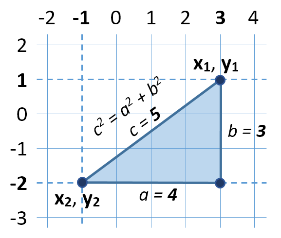
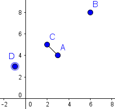
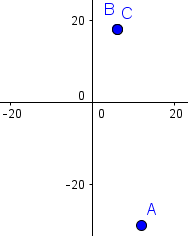
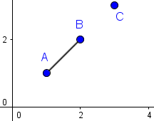
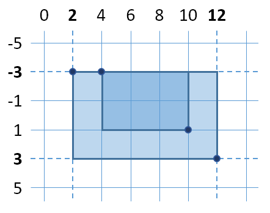
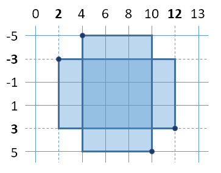

#Exercise: Objects and Classes

## 01. Distance Between Points

Write a method to calculate the distance between two points p1 {x1, y1} and p2 {x2, y2}. Write a program to read two points (given as two integers) and print the Euclidean distance between them.

<table>
<thead>
<tr>
<th>Input</th>
<th>Output</th>
</tr>
</thead>
<tbody>
<tr>
<td>3 4 6 8</td>
<td>5.000</td>
</tr>
<tr>
<td>3 4 5 4</td>
<td>2.000</td>
</tr>
<tr>
<td>8 -2 -1 5</td>
<td>11.402</td>
</tr>
</tbody>
</table>

### Hints
- Create a class Point holding properties X and Y.
- Write a method CalcDistance(p1, p2) that returns the distance between the given points – a number.
- Use this formula to calculate the distance between two points. How it works?
    - Let's have two points p1 {x1, y1} and p2 {x2, y2}
    - Draw a right-angled triangle
    - Side a = |x1 - x2|
    - Side b = |y1 - y2|
    - Distance == side c (hypotenuse)
    - c2 = a2 + b2 (Pythagorean theorem)
    - Distance = c = √(a^2+b^2 )
    
    
    
- You can use math.sqrt(number) method for calculating a square root.
- Print the distance formatted to the 3rd decimal point.

<b>Solution: <a href="./ex_01_distance_between_points.py">ex_01_distance_between_points.py</a></b>

## 02. Closest Two Points

Write a program to read n points and find the closest two of them.

### Input

The input holds the number of points n and n lines, each holding a point {X and Y coordinate}.

### Output

- The output holds the shortest distance and the closest two points.
- If several pairs of points are equally close, print the first of them (from top to bottom). 

### Examples

<table>
<thead>
<tr>
<th>Input</th>
<th>Output</th>
<th>Visualization</th>
<th>Comments</th>
</tr>
</thead>
<tbody>
<tr>
<td>4 3 4 6 8 2 5 -1 3</td>
<td>1.414 (3, 4) (2, 5)</td>
<td></td>
<td>The closest two points are {3, 4} and {2, 5} at distance 1.4142135623731 ≈ 1.414.</td>
</tr>
<tr>
<td>3 12 -30 6 18 6 18</td>
<td>0.000 (6, 18) (6, 18)</td>
<td></td>
<td>Two of the points have the same coordinates {6, 18}, so the distance between them is 0.</td>
</tr>
<tr>
<td>3 1 1 2 2 3 3</td>
<td>1.414 (1, 1) (2, 2)</td>
<td></td>
<td>The pairs of points {{1, 1}, {2, 2}} and {{2,2}, {3,3}} stay at the same distance, but the first pair is {{1, 1}, {2, 2}}. The distance between them is 1.4142135623731 ≈ 1.414.</td>
</tr>
</tbody>
</table>

### Hints

- Use the class Point you created in the previous task.
- Create an array  points that will keep all points.
- Create a method find_closest_points(points) that will check distance between every two pairs from the array of points and returns the two closest points in a new array.
- Print the closest distance and the coordinates of the two closest points.

<b>Solution: <a href="./ex_02_closest_two_points.py">ex_02_closest_two_points.py</a></b>

## 03. Rectangle Position

Write a program to read two rectangles {left, top, width, height} and print whether the first is inside the second.

The input is given as two lines, each holding a rectangle, described by 4 integers: left, top, width and height.

### Examples

<table>
<thead>
<tr>
<th>Input</th>
<th>Output</th>
<th>Visualization</th>
<th>Comments</th>
</tr>
</thead>
<tbody>
<tr>
<td>4 -3 6 4 2 -3 10 6</td>
<td>Inside</td>
<td></td>
<td>The first rectangle stays inside the second.</td>
</tr>
<tr>
<td>2 -3 10 6 4 -5 6 10</td>
<td>Not inside</td>
<td></td>
<td>The rectangles intersect, no the first is not inside the second.</td>
</tr>
</tbody>
</table>
		 	
### Hints

- Create a class Rectangle holding properties Top, Left, Width and Height.
- Define calculated properties Right and Bottom.
- Define a method is_inside(rectangle). A rectangle r1 is inside another rectangle r2 when:
    - r1.left ≥ r2.left
    - r1.right ≤ r2.right
    - r1.top ≤ r2.top
    - r1.bottom ≤ r2.bottom
- Create a method to read a Rectangle.
- Combine all methods into a single program.

<b>Solution: <a href="./ex_03_rectangle_position.py">ex_03_rectangle_position.py</a></b>

## 04. Exercises

Exercises are fun … Especially when they represent a problem from your exercises.

Implement a class Exercise, which has a topic (string), a course_name (string), a judge_contest_link (string), and problems (collection of strings).

You will receive several input lines containing information about a single exercise in the following format:

    {topic} -> {course_name} -> {judge_contest_link} -> {problem1}, {problem2}. . .

You need to store every exercise in a Collection of Exercises. When you receive the command “go go go”, you end the input sequence.

You must print every exercise, in the following format: 

    Exercises: {topic}
    Problems for exercises and homework for the "{course_name}" course @ SoftUni.
    Check your solutions here: {judge_contest_link}
    1. {problem1}
    2. {problem2}
    . . .
    
### Examples

#### Input

    ObjectsAndSimpleClasses -> ProgrammingFundamentalsExtended -> https://judge.softuni.bg/Contests/439 -> Exercises, OptimizedBankingSystem, Animals, Websites, Boxes, BoxIntersection, Messages
    go go go

#### Output

    Exercises: ObjectsAndSimpleClasses
    Problems for exercises and homework for the "ProgrammingFundamentalsExtended" course @ SoftUni.
    Check your solutions here: https://judge.softuni.bg/Contests/439
    1. Exercises
    2. OptimizedBankingSystem
    3. Animals
    4. Websites
    5. Boxes
    6. BoxIntersection
    7. Messages

<b>Solution: <a href="./ex_04_exercises.py">ex_04_exercises.py</a></b>

## 05. Optimized Banking System

Create a class BankAccount which has a Name (string), Bank (string) and Balance (decimal). 

You will receive several input lines, containing information in the following way:

    {bank} | {accountName} | {accountBalance}

You need to store every given Account. When you receive the command “end” you must stop the input sequence.

Then you must print all Accounts, ordered by their balance, in descending order, and then by length of the bank name, in ascending order.

The accounts must be printed in the following way “{accountName} -> {balance} ({bank})”.

Note: Numbers must be printed rounded to the 2nd decimal digit.

### Examples

#### Input

    DSK | Ivan | 504.403
    DSK | Pesho | 2000.4031
    DSK | Aleksander | 20000.0001
    Piraeus | Ivan | 504.403
    Piraeus | Aleksander | 20000.0001
    end

#### Output

    Aleksander -> 20000.00 (DSK)
    Aleksander -> 20000.00 (Piraeus)
    Pesho -> 2000.40 (DSK)
    Ivan -> 504.40 (DSK)
    Ivan -> 504.40 (Piraeus)

<b>Solution: <a href="./ex_05_optimized_banking_system.py">ex_05_optimized_banking_system.py</a></b>

## 06. Animals \*

You have been given the task to create classes for several sophisticated animals.

Create a class Dog which has a name (string), age (int) and number_of_legs (int).

Create a class Cat which has a name (string), age (int) and intelligence_quotient (int).

Create a class Snake which has a name (string), age(int) and cruelty_coefficient (int).

Create a method in each class which is called produce_sound(). The method should print on the console a string depending on the class:

- If it’s a Dog, you should print “I'm a Distinguishedog, and I will now produce a distinguished sound! Bau Bau.”
- It it’s a Cat, you should print “I'm an Aristocat, and I will now produce an aristocratic sound! Myau Myau.”
- If it’s a Snake, you should print “I'm a Sophistisnake, and I will now produce a sophisticated sound! Honey, I'm home.”

Now for the real deal. You will receive several input commands, which will register animals or make them produce sounds, until you receive the command “I’m your Huckleberry”.

The commands will be in the following format:

    {class} {name} {age} {parameter}

The class will be either “Dog”, “Cat” or “Snake”. The name will be a simple string, which can contain any ASCII character BUT space. The age will be an integer. The parameter, will be an integer. Depending on the class it would either be number of legs, IQ, or cruelty coefficient.

Register each animal, and keep them in collections, by your choice, so that you can ACCESS THEM BY NAME. You will most likely need 3 collections, to store the different animals inside them.

Between the register commands you might receive a command in the following format:

    talk {name}

You must then make the animal with the given name, produce a sound.

When you receive the ending command, you should print every animal in the following format:

- If it’s a Dog, you should print “Dog: {name}, Age: {age}, Number Of Legs: {numberOfLegs}”
- It it’s a Cat, you should print “Cat: {name}, Age: {age}, IQ: {intelligenceQuotient}”
- If it’s a Snake, you should print “Snake: {name}, Age: {age}, Cruelty: {crueltyCoefficient}”

Print first the Dogs, then the Cats, and lastly – The Snakes.

### Constraints

- You can assume that there will be no duplicate names (even in different animals).
- All input data will be valid. There will be no invalid input lines.
- The name in the talk command, will always be existent.
	
### Examples

#### Input

    Dog Sharo 3 4
    Cat Garfield 5 200
    Snake Alex 25 1000
    talk Sharo
    talk Garfield
    talk Alex
    I'm your Huckleberry

#### Output

    I'm a Distinguishedog, and I will now produce a distinguished sound! Bau Bau.
    I'm an Aristocat, and I will now produce an aristocratic sound! Myau Myau.
    I'm a Sophistisnake, and I will now produce a sophisticated sound! Honey, I'm home.
    Dog: Sharo, Age: 3, Number Of Legs: 4
    Cat: Garfield, Age: 5, IQ: 200
    Snake: Alex, Age: 25, Cruelty: 1000

#### Input

    Dog Bau 5 10
    Cat Myau 5 100
    Dog Georgi 20 1000
    Cat Bojo 4 20
    talk Bojo
    I'm your Huckleberry

#### Output

    I'm an Aristocat, and I will now produce an aristocratic sound! Myau Myau.
    Dog: Bau, Age: 5, Number Of Legs: 10
    Dog: Georgi, Age: 20, Number Of Legs: 1000
    Cat: Myau, Age: 5, IQ: 100
    Cat: Bojo, Age: 4, IQ: 20

<b>Solution: <a href="./ex_06_animals.py">ex_06_animals.py</a></b>

## 07. Websites

You have been tasked to create an ordered database of websites. For the task you will need to create a class Website, which will have a Host, a Domain and Queries.

The Host and the Domain are simple strings. 

The Queries, is Collections of strings.

You will be given several input lines in the following format:

    {host} | {domain} | {query1,query2. . .}

Note: There will always be a host and a domain, but there might NOT be ANY queries.

The input sequence ends, when you receive the command “end”. Then you must print all websites in the following format:

    https://www.{host}.{domain}/query?=[{query1]&[{query2}]&[query3]. . .

In case there are NO queries, just print:

    https://www.{host}.{domain}

### Examples

#### Input

    softuni | bg | user,course,homework
    judge.softuni | bg | contest,bg
    google | bg | search,query
    zamunda | net
    end

#### Output

    https://www.softuni.bg/query?=[user]&[course]&[homework]
    https://www.judge.softuni.bg/query?=[contest]&[bg]
    https://www.google.bg/query?=[search]&[query]
    https://www.zamunda.net

<b>Solution: <a href="./ex_07_websites.py">ex_07_websites.py</a></b>

## 08. Boxes

Create a class Box, which will represent a rectangular box. The Box should have UpperLeft (Point), UpperRight (Point), BottomLeft (Point), BottomRight (Point). 

Create, or use from the Lab, the class Point which has X (int) and Y (int) – coordinates in 2D space. Move the CalculateDistance() method in the Point class, exactly as it is. Then use “Point.CalculateDistance(point1, point2)” signature, to use the method.

Create 2 methods in the Box class:

CalculatePerimeter(width, height)

CalculateArea(width, height). 

Make them return integers, representing the perimeter and area of the box.

The formulas are respectively – (2 * Width + 2 * Height) and (Width * Height). 

The Width is the distance between the UpperLeft and the UpperRight Points, and ALSO – the Bottomleft and the BottomRight Points.

The Height is the distance between the UpperLeft and the BottomLeft Points, and ALSO – the UpperRight and the BottomRight Points.

You will receive several input lines in the following format:

    {X1}:{Y1} | {X2}:{Y2} | {X3}:{Y3} | {X4}:{Y4}

Those will be the coordinates to UpperLeft, UpperRight, BottomLeft and BottomRight (IN THE SAME ORDER).

When you receive the command “end”. You must print all Boxes in the following format:

    Box: {width}, {height}
    Perimeter: {perimeter}
    Area: {area}

### Examples

<table>
<thead>
<tr>
<th>Input</th>
<th>Output</th>
</tr>
</thead>
<tbody>
<tr>
<td>0:2 | 2:2 | 0:0 | 2:0 -3:0 | 0:0 | -3:-3 | 0:-3 -2:2 | 2:2 | -2:-2 | 2:-2 end</td>
<td>Box: 2, 2 Perimeter: 8 Area: 4 Box: 3, 3 Perimeter: 12 Area: 9 Box: 4, 4 Perimeter: 16 Area: 16</td>
</tr>
</tbody>
</table>

<b>Solution: <a href="./ex_08_boxes.py">ex_08_boxes.py</a></b>

## 09. Messages \*

Create a class User, which has a Username (string), and ReceivedMessages (Collection of Messages). 

Create a class Message, which has a Content (string) and a Sender (User).

You will have to store a messaging history for every user. The input consists of 2 commands:

    “register {username}”
    “{senderUsername} send {recipientUsername} {content}”

The register command, registers a user with the given username. 

The send command, sends a message, from the given sender, to the given recipient, with the given content. That means that you must add the message to the recipient’s ReceivedMessages.

If even one of the given names does NOT exist, ignore the command.

When you receive the command “exit” you must end the input sequence. After that you will receive 2 usernames, separated by a space. 

You must print all messages, sent, between the two users, corresponding to the given usernames. The messages should be printed in a specified way. You should print first a message SENT from the first user, then a message SENT from the second user, then a message from the first user, and so on. If one of the collections of messages has more elements than the other, just print the remaining elements from it.

The first user’s messages must be printed in the following way:

    “{firstUser}: {content}”

The second user’s message must be printed in the following way:

    “{content} :{secondUser}”

When you print the whole output, it should look like this:

    {firstUser}: {content1}
    {content1} :{secondUser}
    {firstUser}: {content2}
    {content2} :{secondUser}
    . . . 

In case there are NO messages between the two users, print “No messages”.

### Examples

<table>
<thead>
<tr>
<th>Input</th>
<th>Output</th>
</tr>
</thead>
<tbody>
<tr>
<td>register Ivan register Pesho Ivan send Pesho pesho Ivan send Pesho pesho_tam_li_si? Pesho send Ivan kaji_vanka Pesho send Ivan tuk_sum Pesho send Ivan chakai_che_bachkam Ivan send Pesho kvo_stava Ivan send Pesho kak_si Ivan send Pesho deka_izbega_be? Ivan send Pesho pecaaa!!! exit Ivan Pesho</td>
<td>Ivan: pesho kaji_vanka :Pesho Ivan: pesho_tam_li_si? tuk_sum :Pesho Ivan: kvo_stava chakai_che_bachkam :Pesho Ivan: kak_si Ivan: deka_izbega_be? Ivan: pecaaa!!!</td>
</tr>
<tr>
<td>register John John send Harry harry_you_there? register Harry John send Harry harry? register Donald Harry send John yeah_sorry_was_out... Harry send John wassup? Donald send John Yo_John? Donald send Jonh You_there? John send Harry thank_god!! John send Harry I_need_you! exit John Harry</td>
<td>John: harry? yeah_sorry_was_out... :Harry John: thank_god!! wassup? :Harry John: I_need_you!</td>
</tr>
</tbody>
</table>

<b>Solution: <a href="./ex_09_messages.py">ex_09_messages.py</a></b>

<b>Document with tasks description: <a href="../resources/l_08_object_and_classes/04. Python-Fundamentals-Objects-and-Classes-Exercise.docx">04. Python-Fundamentals-Objects-and-Classes-Exercise.docx</a></b>
